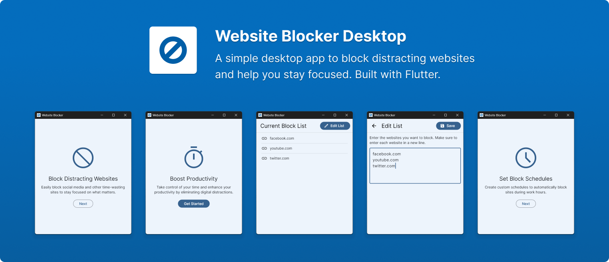

<p align="center">

</p>

<p align="center">
  A simple desktop app to block distracting websites and help you stay focused. Built with Flutter.
</p>

------

Website Blocker is a simple, open-source desktop application that helps you stay focused by updating your hosts file to block distracting websites. Built with Flutter and Dart, it currently supports Windows (with plans for Mac and Linux later).

<p align="center">

</p>

## Features

- **Easy Website Blocking:** Paste a list of websites (one per line) to block them.
- **Validation:** Automatically parses and validates website domains.
- **Hosts File Management:** Inserts blocked sites into your Windows hosts file between custom markers.

## Platform Support

- **Windows:** Fully supported. You can build the app or download it from the releases page.
- **Linux & MacOS:** Currently limited due to administration access permissions on app launch. Contributions to add support are welcome via PR.

## Disclaimer

This app requires admin privileges to modify the system hosts file. It creates a backup of the hosts file named `hosts.backup` in the same directory so you can always revert to the previous version.

## Installation

Download the build files from the releases page, extract them, and run the app as administrator.

## For Developers

Because this app requires admin privileges, you must either:

- Run your IDE or terminal as administrator, or
- Remove the privilege flag from `windows/runner/CMakeLists.txt`. (Note: Removing the flag will disable the hosts file update functionality.)

```cmake
# Add the manifest flags here
set_target_properties(${BINARY_NAME} PROPERTIES LINK_FLAGS "/MANIFESTUAC:\"level='requireAdministrator' uiAccess='false'\" /SUBSYSTEM:WINDOWS")
```

## Build

1. **Clone the repository:**

   ```bash
   git clone https://github.com/aymendn/website-blocker-desktop.git
   ```

2. **Navigate to the project directory:**

   ```bash
   cd website-blocker-desktop
   ```

3. **Build the project:**

   ```bash
   flutter build windows

   # To run the app:
   flutter run -d windows
   ```

## What’s Next?

- Support for Linux and MacOS
- Improved websites configuration UI
- Dark mode
- More tests

## Contributing

Contributions are welcome! Feel free to:

- Open issues or pull requests.
- Follow the existing code style.
- Add tests for any new functionality.